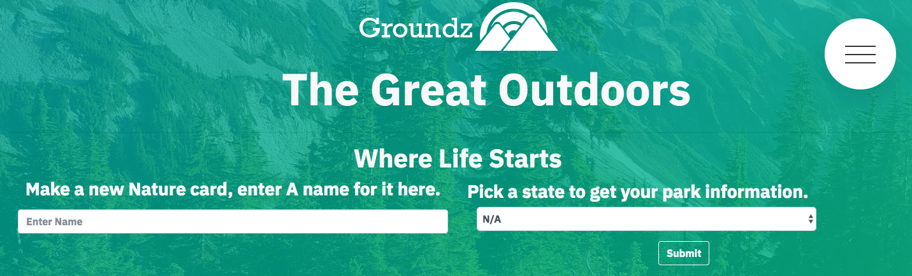
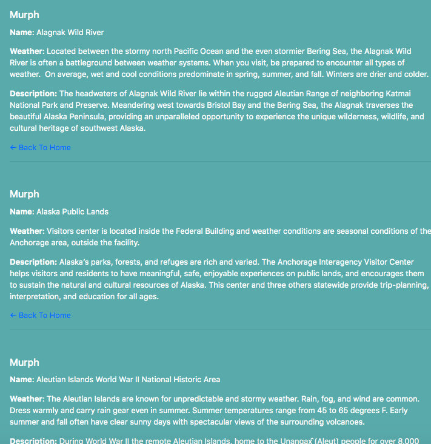

# Groundz 


<br>

## Problem

Groundz is for anyone looking to explore the national parks in whatever state they may end up in. A viewer may need to google the parks in their area but what about a way to track places their friends have been interested in? Groundz remembers your parks by generating cards with your trip information.

<br>

## Overview of App Organization

This is app contains the following files:

  ```
  Full-Stack
    - config
      - config.json
    - models
      - example.js
      - index.js
      - schema.sql
      - test.sql
    - public
      - images
      - js
        - index.js
      - styles
        - styles.css
    - routes
      - apiRoutes.js
      - htmlRoutes.js
    - test
      - canary.test.js
    - views
      - layouts
        - main.handlebars
      - partials
        - cards
          - card-block.handlebars
          - card-parks.handlebars
      - 400.handlebars
      - 404.handlebars
      - aboutUs.handlebars
      - example.handlebars
      - index.handlebars
    - node_modules
    - package.json
    - server.js
    - .gitignore
  ```
<br>

## Run Instructions

The user begins at:


<br>

After a search is submitted a card is made and saved to the database with trip information:


When the users card is clicked the infomation regarding the trip options from the National Parks API is displayed as below:


## This App Utilizes

   * [Node](https://nodejs.org/en/about/)

   * [Express](https://www.npmjs.com/package/express)

   * [Handlebars](https://handlebarsjs.com/)

   * [Sequelize](https://www.npmjs.com/package/sequelize)

   <br>

## Development Team

My name is Alex I worked on the backend of the website my portfolio can be found
[here]( https://alexsamalot19.github.io/Samalot-Alexander-Portfolio/).

We designed this app using existing APIs and packages listed in the **This App Utilizes** section. We used Node and Sequelize to query and route data in this app, and Handlebars to generate the HTML. The site is deployed to Heroku [here](https://the-groundz.herokuapp.com/).
